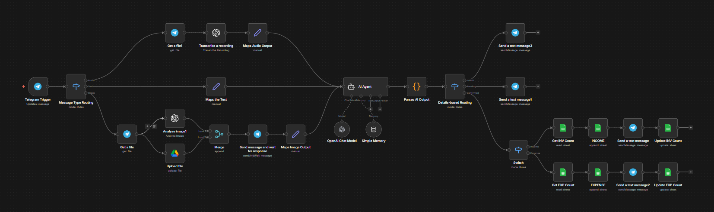

# Telegram Accounting Bot Automation (n8n)

An AI-powered accounting automation workflow built in n8n that enables users to record income and expenses via Telegram using natural language, voice messages, image OCR, and automated counters with Google Sheets integration.

---

## 📌 Overview

This project connects Telegram, OpenAI, Google Sheets, and Google Drive to build a structured accounting capture system.

Users can:

- Record income using text or voice  
- Record expenses using text or voice  
- Upload bank transaction screenshots  
- Upload invoice / receipt images  
- Confirm extracted transaction details before saving  
- Automatically generate incremented IDs (INC-000001 / EXP-000001)  
- Store attachments in Google Drive  
- Log structured entries in Google Sheets  

The workflow ensures all entries are reviewed before confirmation and saved with proper auto-increment IDs using a Counters sheet.

---

## 🏗️ Workflow Architecture

### Main Components

- Telegram Trigger  
- Message Type Routing (Text / Voice / Image)  
- Get File (Voice & Image handling)  
- OpenAI Transcription (Voice → Text)  
- OpenAI Vision (Image OCR)  
- AI Agent (Accounting extraction + intent detection)  
- Parse AI Output  
- Status-Based Routing (Invalid / Pending / Confirmed)  
- Confirmation Message (Telegram)  
- Counters Sheet Logic (Auto-Increment ID)  
- Google Sheets Append (Income / Expense)  
- Google Drive Upload (Attachments)  
- Telegram Confirmation Message  

---

## 🔄 Workflow Visual

---

## 🧠 How It Works

### 1. User Input (Telegram)

The bot accepts:
- Text messages  
- Voice messages (auto-transcribed)  
- Image uploads (bank screenshots / invoices)  

The workflow detects the message type and routes accordingly.

---

### 2. AI Processing

The AI Agent:

- Detects whether the message is:
  - A new accounting entry  
  - A continuation of a pending entry  
  - An unrelated message (returns status: Invalid)  

- Extracts structured data:
  - Entry Type (Income / Expense)
  - Category
  - Party (Client / Vendor)
  - Amount
  - Payment Method
  - Transaction Type
  - Reference Number
  - Notes
  - Source

- Assigns initial status: **Pending**

---

### 3. Confirmation Flow

When status is **Pending**, the bot sends a structured summary to Telegram:

- Type  
- Date  
- Category  
- Party  
- Amount  
- Payment Method  
- Reference  
- Notes  

User options:

- ✅ Confirm  
- ✏️ Edit  
- ❌ Cancel  

If confirmed:
- Status changes to **Confirmed**
- ID is generated
- Entry is written to Google Sheets

---

### 4. Auto-Increment ID System (Counters Sheet)

A dedicated **Counters** sheet is used:

| Type     | LastNumber |
|----------|------------|
| INCOME   | 1392       |
| EXPENSE  | 417        |

When a transaction is confirmed:

- The corresponding counter is read  
- Number is incremented  
- New ID is generated:
  - `INC-0001393`
  - `EXP-0000418`
- Counter is updated  
- Entry is appended to ledger  

This ensures:
- No duplicate IDs  
- Concurrency safety  
- Scalability  

---

### 5. Google Sheets Integration

Two main sheets are maintained:

**Income Sheet**
- Income ID
- Date
- Income Type
- Client Name
- Amount
- Currency
- Payment Method
- Transaction Type
- Reference Number
- Notes
- Source
- Status
- Created At

**Expense Sheet**
- Expense ID
- Date
- Expense Category
- Vendor Name
- Amount
- Currency
- Payment Method
- Transaction Type
- Reference Number
- Notes
- Source
- Status
- Created At

---

### 6. Google Drive Integration

For image-based entries:

- Files are uploaded automatically
- Stored in structured folders:
  - `Accounting Attachments/Expenses/YYYY/MM`
  - `Accounting Attachments/Bank Screenshots/YYYY/MM`
- Drive link is stored in the sheet

---

## 🛠️ Tech Stack

- n8n (Workflow Automation)
- Telegram Bot API
- OpenAI (Chat Model + Vision + Transcription)
- Google Sheets API
- Google Drive API
- OAuth2 Authentication

---

## 🔐 Required Credentials

To run this workflow, configure the following in n8n:

- Telegram Bot Token  
- OpenAI API Key  
- Google OAuth2 Credentials (Sheets + Drive access)  

---

## ✅ Features

- Natural language accounting entry
- Voice message support
- Image OCR (bank screenshots & invoices)
- Pending → Confirmed review system
- Intent detection (Invalid message handling)
- Auto-increment ID using Counters sheet
- Structured Google Sheets logging
- Google Drive attachment storage
- Clean status-based routing
- Scalable architecture

---

## 🎯 Use Cases

- Small business accounting capture
- Field staff expense logging
- Tour/activity income tracking
- Telegram-based bookkeeping assistant
- AI automation portfolio project
